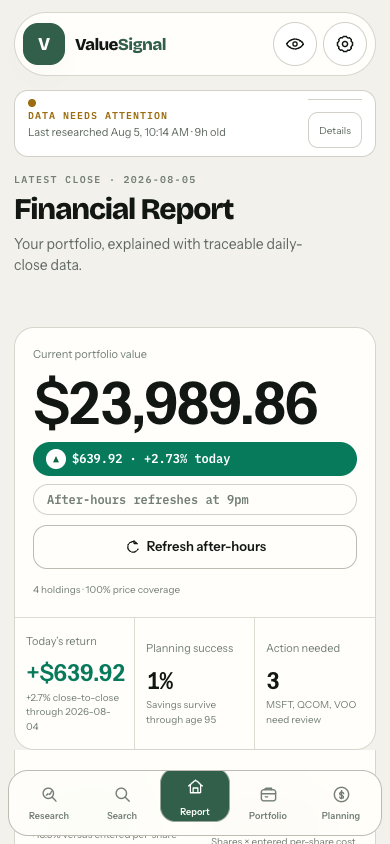
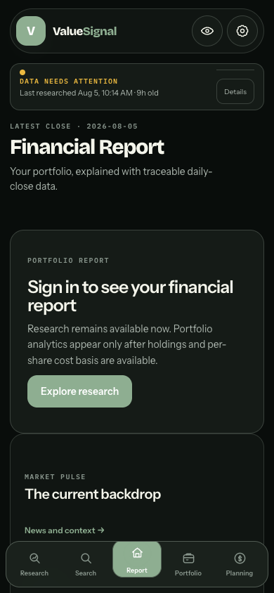
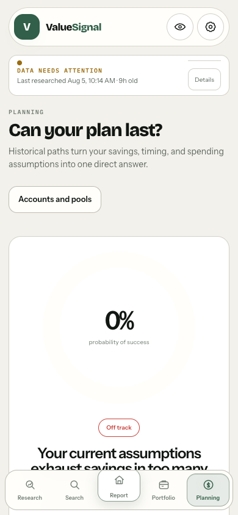
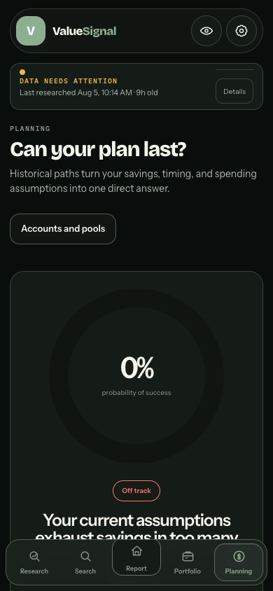
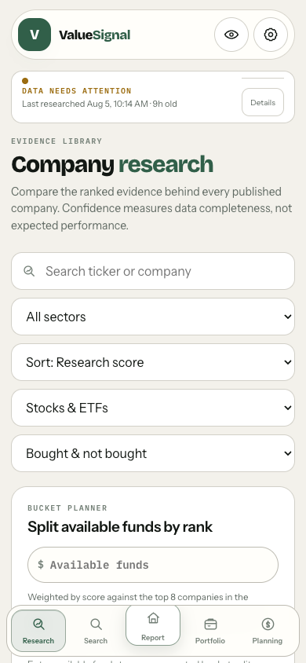
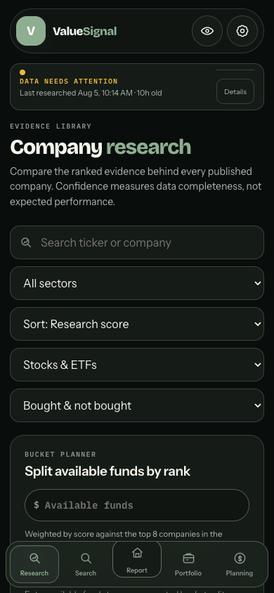
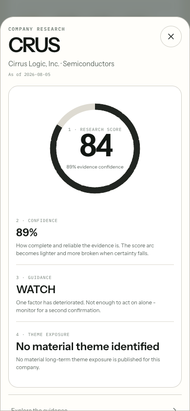
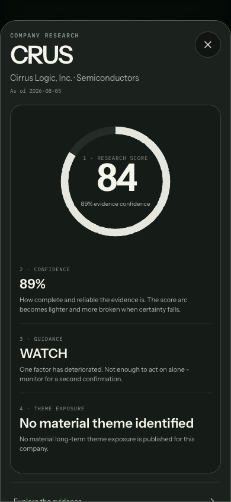

> **Historical snapshot, not current status.** Written mid-project; specific counts (test totals, universe size) and some completeness claims are now stale. For the authoritative account of this upgrade see `docs/CHANGELOG-QUANT-UPGRADE.md`; for current repo state see `README.md` and `APP-COMPLETE-BREAKDOWN.md`.

---

# ValueSignal upgrade report V25

Completed: 2026-08-05

## Executive verdict

All seven phases are implemented. Phase 1 was not an audit that passed. Implementation was still needed. The production champion remains on discrete bands and the completed cross-sectional model ships beside it as the challenger.

The repository now includes the required normalization evidence, an append-only point-in-time store, portfolio concentration and factor analytics, exact score attribution, a top-level Planning destination, a deliberate mobile visual system, weighted news intelligence, and the focused dependency and bundle pass.

## Phase 1: normalization and point-in-time evidence

Required artifacts:

- [Normalization audit](pipeline/reports/normalization_audit.json)
- [Champion versus challenger diff](pipeline/reports/normalization_diff.json)
- [Bias check](pipeline/reports/bias_check.json)

### Verdict

Implementation was still needed. All 32 configured metrics now have a cross-sectional challenger path. The challenger winsorizes at the 1st and 99th percentiles and ranks within GICS sector when at least 8 valid names are present. It falls back to the complete universe otherwise. Lower-is-better metrics are reversed, range metrics rank distance from their ideal, and nonpositive valuation multiples are not applicable.

The only metric without a usable current percentile distribution is earnings surprise because the current universe snapshot contains no valid observations for it. The path exists and is reported as insufficient universe rather than silently reverting to fixed bands.

### Rank and sector evidence

- Full comparison universe: 616 names
- Champion versus challenger Spearman rank correlation: 0.816041
- Largest mover: EIX, up 390 ranks in the challenger
- Highest sector mean absolute score change: Financial Services at 20.581 points
- Next highest: Technology at 17.277 and Energy at 16.276 points

The diff artifact contains all 20 requested rank movers, per-metric attribution, mean absolute score change by sector, and side-by-side sector means and standard deviations.

### Bias evidence

| Relationship | Old double penalty Pearson | New single shrinkage Pearson | Old Spearman | New Spearman |
| --- | ---: | ---: | ---: | ---: |
| Score vs log market cap | -0.098444 | -0.004967 | 0.032057 | -0.010684 |
| Score vs confidence | 0.196794 | 0.099108 | 0.314832 | 0.212719 |
| Score vs analyst coverage | -0.112903 | 0.016765 | -0.085597 | 0.037288 |

Absolute market-cap correlation dropped under both Pearson and Spearman. The single-shrinkage acceptance check passes.

### Point-in-time store

- Rich PIT files: 1
- Rich PIT rows: 730
- Rich PIT refreshes: 2
- Latest rich refresh rows: 365
- Raw prospective observations: 2,259
- Raw prospective tickers: 617
- Observed calendar days: 2
- Append-only contract: enabled
- Backfill: prohibited

Valuation own-history fields are published by the model, but no current name has the minimum 12 prospective observations yet. This is an honest accumulating state. Historical values were not invented or backfilled.

## Phase 2: portfolio risk and factor exposure

Implemented:

- HHI and effective number of holdings
- Trailing 252-day pairwise correlation matrix
- Effective number of bets from weighted correlation eigenvalues
- Diversification ratio
- HHI-calibrated concentration penalties
- ETF sector and top-holding look-through
- Explicit unresolved ETF exposure and dollar amount
- Marginal and percent contribution to risk
- Tracking error and conditional active share
- Historical expected shortfall at 95%
- Portfolio-level theme exposure kept separate from research score
- Monthly Fama/French five-factor plus momentum cache
- OLS loadings, standard errors, alpha, alpha t-statistic, R-squared, and plain-language summary
- Honest accumulating state below 24 monthly observations

The factor source cache contains 756 monthly observations through 2026-06. The implementation uses the official [Kenneth R. French Data Library](https://mba.tuck.dartmouth.edu/pages/faculty/ken.french/data_library.html).

### Sample portfolio regression

[Full sample output](pipeline/reports/factor_regression_sample.json)

Sample: 60% SPY, 25% QQQ, and 15% IWM using committed adjusted-close total-return histories. Starting weights drift with performance.

| Factor | Loading | Standard error |
| --- | ---: | ---: |
| Market excess | 1.0273 | 0.0110 |
| Size | -0.0234 | 0.0203 |
| Value | -0.0592 | 0.0178 |
| Profitability | -0.0274 | 0.0216 |
| Investment | -0.0173 | 0.0257 |
| Momentum | -0.0003 | 0.0140 |

- Observations: 101, from 2018-02 through 2026-06
- Annualized alpha: 0.9979%
- Alpha t-statistic: 1.6623
- R-squared: 0.991567
- Summary: Your portfolio behaves like a broad market allocation.
- Interpretation: the alpha t-statistic is under 2 in absolute value and means nothing statistically.

Acceptance tests include the hand-computed four-position HHI and effective-N case, ETF plus direct constituent overlap, and risk contributions summing to 100%.

## Phase 3: explainability

Every published company now carries champion and challenger attribution that reconciles from a base of 50 through evidence, confidence shrinkage, modifiers, and score rounding.

Published invariant result:

- Companies checked: 40
- Attribution variants checked: 80
- Maximum reconciliation error: 0.00
- Allowed error: 0.01
- Result: pass

The stock detail sheet now renders the confidence-encoded score dial, the four-concept first screen, six factor bars, three largest contribution callouts, a full waterfall, metric explanations, anomaly narration, and point-in-time score history. Score history currently reports 1 stored month of the required 6 and therefore shows the accumulating state instead of a misleading short line.

## Phase 4: Planning

Planning is a top-level route and the fifth bottom-navigation destination. Home also links to it directly.

Implemented:

- Probability-of-success gauge and configured verdict bands
- Most effective contribution lever callout
- Monthly contribution, retirement age, annual real withdrawal, and allocation aggressiveness controls
- Web Worker resimulation on release
- Per-lever probability deltas
- Scrubbable 10th, 50th, and 90th percentile fan chart
- Dotted projected median convention
- Sequence-of-returns comparison
- Named goals using the Finances pool model
- Additive finance schema v2 migration
- Benchmark-centered sparse-history correction

[Projection spread evidence](pipeline/reports/projection_spread_comparison.json)

| Sparse-history method | 30-year p90 minus p10 spread |
| --- | ---: |
| Old repeated observed pattern | $0.00 |
| New benchmark-centered history | $4,905,626.70 |

The deterministic 5,000-path fixture completed in 20.906 ms against the 400 ms interaction budget. Runtime varies by device, so the unit test also enforces the configured budget in the current test environment.

The short-history notice states that the simulation uses benchmark history centered on the return actually recorded. Observed months are never repeated or synthesized.

## Phase 5: mobile visual identity

The interface now has independent canvas, shelf, card, and sheet tokens in both themes. Elevation uses borders instead of shadows. Gain and loss are the only saturated semantic tones, and directional values also use triangle glyphs.

Implemented across the mobile surface:

- Floating pill headers on Home and Research
- Sectioned shelves
- Gain and loss value capsules
- Local as-of labels
- Full-width sheet selectors
- Horizontal research-signal and theme rails
- Large tabular portfolio and score figures
- Dotted projected lines
- Horizontal finance account tabs
- Confidence-encoded stock score dial
- Development-only portfolio fixture for repeatable Home screenshot evidence

[Color accessibility evidence](pipeline/reports/color_accessibility_check.json) passes the configured contrast and simulated color-vision separation thresholds. [Mobile visual evidence](pipeline/reports/mobile_visual_check.json) contains all 16 cases at 390px and 430px in both themes. Every case has no horizontal overflow, a fully visible bottom nav, no undersized interactive target, and static reduced-motion behavior.

### Required 390px screenshots

#### Home

#### Planning

#### Research

#### Stock detail

## Phase 6: news intelligence

News remains 4% of the research blend. The new additive advisor schema v5 publishes the weighting detail and migrates older snapshots without pretending they used the new method.

The composite now applies:

- Exponential recency decay with a configurable 3-day half-life
- Configured source quality tiers
- Separate filing and commentary labels and weights
- Minimum entity confidence filtering
- Title-similarity novelty deduplication
- Full coverage at 8 deduplicated and confidence-filtered articles

The acceptance test supplies nine copies of one syndicated story. The result is 1 counted article, 8 removed copies, and 12.5% coverage rather than full coverage.

## Phase 7: hygiene

[Hygiene evidence](pipeline/reports/hygiene_check.json)

- High-severity advisories before: 2
- High-severity advisories after: 0
- `brace-expansion`: 5.0.7 to 5.0.9
- `undici`: 7.28.0 to 7.29.0
- Main entry: 976,040 bytes to 180,969 bytes
- Main entry reduction: 81.46%
- Largest JavaScript chunk: 307,507 bytes
- Every JavaScript chunk below 500,000 bytes: pass

Vite 8 uses Rolldown's current `codeSplitting` configuration instead of the deprecated object-form manual chunks. See the official [Vite build options](https://vite.dev/config/build-options.html) and [Rolldown code-splitting reference](https://www.rolldown.rs/reference/TypeAlias.CodeSplittingGroup).

[APP-COMPLETE-BREAKDOWN.md](APP-COMPLETE-BREAKDOWN.md) is regenerated by script from the current route tree, package versions, settings, published data counts, and PIT store depth.

## Verification

- Python pipeline: 519 passed
- Frontend: 277 passed across 46 files
- ESLint: passed
- Production build: passed
- Attribution invariant: 80 of 80 passed
- Projection interaction budget: passed
- Mobile screenshots: 16 of 16 passed
- High-severity dependency advisories: 0
- JavaScript chunks over 500 kB: 0

## Items that could not be completed from current inputs

1. Exact comparison against the requested reference images could not be performed because `docs/reference/` is absent from this checkout. The implementation follows the written Fidelity and Robinhood direction and was verified against the generated light and dark screenshots.
2. Own-history percentiles and six-month score evolution cannot be populated immediately because the PIT store is prospective and backfill is prohibited. The fields, UI states, and refresh append path are complete. They will populate after 12 valuation observations and 6 distinct score months respectively.
3. A fresh live Yahoo universe refresh could not complete in this execution environment because Yahoo DNS resolution timed out. The run was stopped before replacing public data. Phase 1 evidence uses the committed full-universe snapshots and the append-only store.
4. Ten moderate npm advisories remain. They are outside the two requested high-severity advisories and are primarily attached to breaking Firebase Admin and React Router upgrade paths. No high or critical advisory remains.
