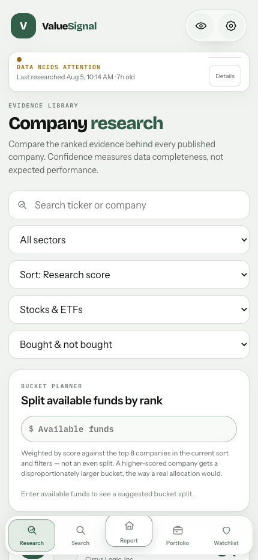
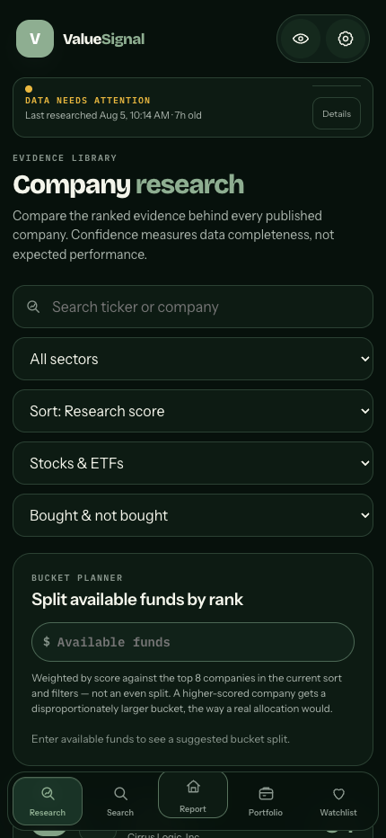

# ValueSignal upgrade report

Report date: 2026-08-05  
Scope: Phases 1 through 10, alert delivery, responsive repair, mobile interaction redesign, risk/performance tones, sparse-history projections, validation, and deployment configuration.

## Executive result

The upgrade is implemented in the local worktree and passes the full available validation suite.

- Frontend: 42 test files and 257 tests pass.
- Pipeline: 506 tests pass in the repository virtual environment.
- ESLint: passes.
- Production build: passes.
- Mobile browser validation: passes at exact 390 px and 430 px viewports in light and dark themes.
- Horizontal overflow: none in all four captured cases.
- Mobile navigation: fully inside the viewport in all four captured cases.
- Phone research controls: confirmed as full-row controls at both widths.

The remaining work is deployment configuration and live delivery verification. Web Push cannot be delivered end to end until Firebase service credentials, VAPID keys, the Netlify delivery secret, and the deployed function URL are configured outside the repository.

## Phase status and comparison

| Phase | Earlier behavior | Upgraded behavior | Status |
| --- | --- | --- | --- |
| 1 | Scoring constants and model behavior were harder to trace across code. | Numerical scoring thresholds and weights are versioned in `pipeline/config/settings.json`, and formula behavior is covered by tests and documentation. | Complete |
| 2 | Short-horizon behavior could contaminate longer-horizon selection logic. | Corrected signal challengers, cross-sectional scoring, and the removal of the short-term return buy gate keep signal horizons separate. | Complete |
| 3 | Model changes could be judged from one equity curve. | Prospective rank IC, ICIR, quantile, deflated-performance, and overfitting checks provide cross-sectional validation. | Complete |
| 4 | Position stops could anchor too heavily to cost basis and hard thresholds. | Volatility-aware position floors and high-water-mark behavior are separated from company research guidance. | Complete |
| 5 | The watchlist setup gate required every condition to pass. | Continuous subscores use a weighted geometric mean, with only confidence integrity and Sell guidance retained as hard blocks. | Complete |
| 6 | Portfolio performance could confuse external cash flows with investment return and sparse histories hid useful planning output. | Cash-flow-aware portfolio analytics, recorded-value series, bootstrap projections, and tested return calculations are present. | Complete |
| 7 | Product behavior and calculations were spread across code with no single full reference. | `APP-COMPLETE-BREAKDOWN.md` documents routes, data, scoring, portfolio analytics, projections, mobile behavior, alerts, and operational flow. | Complete |
| 8 | There was no real alert inbox or Web Push delivery path. | Private Firestore rules, deduplicated evaluator events, an in-app alert center, quiet hours, grouped push delivery, service worker handling, and optional first-rule permission prompting are implemented. | Code complete, deployment configuration required |
| 9 | Several tables disappeared on phones, finance forms stayed cramped, a mobile preference was inert, dead mobile Dashboard CSS remained, and report customization did not affect the report. | Shared phone result cards cover generic research, Congress, and shadow portfolios. Forms stack. The mobile card preference works. Dead dashboard CSS is removed. Report widget visibility and order now control rendered modules. | Complete |
| 10 | Mobile behavior was mostly compressed desktop UI with limited direct chart interaction. | Exact-width layout repair, live touch chart scrubbing, value headers, crosshairs, haptic period changes, bottom sheets, reduced-motion handling, pull-to-refresh, virtualized large lists, and mobile evidence captures are present. | Complete |

## Phase 8: alerts and Web Push

### User-facing alert center

The signed-in `/alerts` route provides:

- New rule creation.
- Saved rule enable, pause, and delete actions.
- An in-app event inbox.
- Unread counts in the navigation badge.
- Mark-one and mark-all read actions.
- Quiet-hour start and end controls.
- A push offer only after the first rule is created.

The app does not request notification permission on page load. An in-app rule is already active before the optional push prompt appears.

### Supported rule types

| Rule | Evaluation |
| --- | --- |
| Price cross | Current published price is compared with an above or below threshold. |
| Percentage move | One-day or five-day return is compared with an absolute percentage threshold and direction. |
| Stop trigger | Current price is compared with the saved Trim or Exit stop. |
| Score band | Published stance is compared with the ordered Attractive, Neutral, Cautious, and Unattractive bands. |
| Guidance change | Fires when guidance changes into Trim or Sell. |
| Earnings upcoming | Fires when a published upcoming earnings date enters the selected notice window. |
| Pipeline stale | Compares current UTC time with the published `generated_at` timestamp. |

### Firestore structure

```text
alerts/<uid>/rules/<ruleId>
alerts/<uid>/events/<eventId>
alerts/<uid>/subscriptions/<endpointHash>
alerts/<uid>/settings/preferences
```

Firestore rules restrict the entire `alerts/<uid>` tree to the authenticated owner.

### Evaluation and deduplication

`pipeline/evaluate_alerts.py` runs after scored data has been validated and published in the refresh workflow.

1. It reads the just-built advisor artifact.
2. It reads Firestore rules through a collection-group query.
3. It computes an observable state and stable fingerprint for each enabled rule.
4. It always writes the latest `lastState` back to the rule.
5. It creates an event only when a condition changes from inactive to active or when an active condition materially changes fingerprint.
6. It groups new events per user.
7. It asks the Netlify delivery function to send one grouped push per user.

The evaluator makes no new market-data provider calls. Missing Firebase credentials skip the alert step cleanly for local and forked workflows.

### Push delivery

`netlify/functions/alert-push.mjs`:

- Accepts POST only.
- Requires the shared alert-delivery secret.
- Uses VAPID credentials only on the server.
- Reads each user's quiet hours and timezone.
- Groups several events into one notification.
- Deletes subscriptions that return HTTP 404 or 410.
- Writes `pushedAt` only after a successful delivery.

`public/sw.js` displays the notification and opens or focuses the relevant ValueSignal route when it is clicked.

## Phase 9: responsive repair and preference wiring

### Table replacements

`ResultCards` is the shared mobile representation for:

- Generic ResearchScreen routes.
- Congress trade disclosures.
- Shadow portfolio performance.

The desktop table remains the dense desktop representation. At 900 px and below only the card representation is mounted. This avoids duplicate accessibility content and prevents a hidden desktop table from being the only result output.

Lists above 50 rows use dynamic window virtualization. The main combined Research library also uses a mobile virtual list above 50 results.

### Mobile research preference

The stored `mobileResearchView` preference now changes the generic screen cards:

- `visual`: classification, composite score, and confidence.
- `detailed`: classification, percentile, structural score, tactical score, confidence, and warnings.

### Responsive forms

The following Finances forms now use shared responsive classes:

- Add income or expense.
- Add savings pool.
- Log deposit.
- Add retirement or investing account.

Each becomes a single-column form below 620 px, with a full-width submit target.

### Congress KPI layout

The five-card summary changes from five columns to three columns below 900 px, then two columns below 620 px. The last item spans the remaining row on the narrow layout.

### Report widget customization

The Financial Report now reads the persisted widget collection when rendering. The configured `visible` flag can remove optional modules, and the persisted `order` sets flex order inside the widget stack.

Wired modules:

- Portfolio summary, locked and always visible.
- Performance chart.
- Key metrics and standard performance measures.
- Top research signal.
- Action-needed summary.
- Sector allocation.
- Watchlist preview.

The sector-allocation widget is a real current-value aggregation by covered holding sector, not a placeholder.

### Preference audit

- Theme, accents, surfaces, corners, density, privacy, number formatting, holdings sort, benchmarks, suggested-action expansion, mobile research view, watchlist sizing, accessibility, and widgets are read by product code.
- Chart style now changes line, area, or stepped path rendering.
- Chart animation and larger-label preferences now set active root data attributes used by chart CSS.
- The unused gain/loss-format control and stored default were removed instead of leaving an inert setting.
- Legacy mobile Dashboard selectors and the unused dedicated-mobile-home block were removed.

## Phase 10: mobile redesign and interaction

### Responsive behavior

- The research filter toolbar is one column below 620 px.
- All toolbar fields use `min-width: 0` and fit the content column.
- The fund-allocation input becomes full width.
- All five mobile navigation destinations share available width and remain visible at 390 px.
- Mobile cards and sheets use theme surfaces, outlined elevation, safe-area padding, and at least 44 px controls.

### Chart scrubbing

`GrowthChart` now supports:

- Pointer and touch selection.
- Correct coordinate mapping inside the plotted area rather than the full SVG edge.
- A vertical crosshair.
- A live date and value header.
- Keyboard Left, Right, Home, and End navigation.
- Area and stepped rendering preferences.
- Light haptic feedback on period changes when vibration is available and reduced motion is not requested.

### Bottom sheets

The reusable mobile sheet provides overlay dismissal, Escape handling, focus restoration, a visible close button, safe-area bottom padding, and reduced-motion behavior.

It is used for:

- Generic research filters.
- Congress filters and sort.
- Portfolio holding sort.
- Financial Report benchmark selection.
- Mobile holding edits.

### Refresh and large-list behavior

- Portfolio pull-to-refresh requests fresh held-symbol quotes.
- Financial Report pull-to-refresh reloads report, advisor, ETF, benchmark, and held-symbol quote data.
- Shared result cards and the main Research mobile list window lists larger than 50 entries.

## Risk and performance color semantics

The standard Risk and performance cards now use both color and a glyph, so meaning is not color-only.

- Green with an upward glyph means the configured good boundary is met.
- Red with a downward glyph means the configured bad boundary is met.
- Values between the boundaries remain neutral.
- Unavailable values remain subdued.

Thresholds are in `pipeline/config/settings.json`:

| Measure | Good at or above | Bad at or below |
| --- | ---: | ---: |
| Information ratio | 0.25 | -0.25 |
| Sharpe ratio | 0.50 | 0.00 |
| Sortino ratio | 0.50 | 0.00 |
| Calmar ratio | 0.50 | 0.00 |
| Maximum drawdown | -10.0% | -20.0% |
| Current drawdown | -5.0% | -10.0% |

Drawdowns closer to zero are better, so a -8% maximum drawdown is green while a -25% maximum drawdown is red.

## Short-history long-range outcome distribution

The 36-month gate is retained as the standard observed-history requirement, but a shorter usable portfolio record no longer hides the chart.

### Source selection

1. Month-end values produce observed monthly returns.
2. At 36 or more monthly returns, the model uses observed portfolio returns directly.
3. Below 36 months, a portfolio record spanning at least 30 days uses the annualized extension.
4. Below 30 days, a benchmark with at least 12 monthly returns remains the fallback.

### Annualized extension formula

For the longest first-to-last recorded span:

```text
annualized return = (ending value / starting value) ^ (365.25 / elapsed days) - 1
target monthly log return = log(1 + annualized return) / 12
```

When observed monthly returns exist, each observed monthly log return is centered around its observed mean and shifted to the target monthly log return. The adjusted pattern is repeated until 36 monthly returns exist.

This preserves the direction and relative month-to-month pattern that was actually observed while matching the annualized longest-span return. It does not manufacture a claim of 36 observed months.

The projection panel displays a prominent short-history notice and repeats the full method in the disclosure. If the record contains little month-to-month variation, it warns that percentile ranges may cluster.

### Bootstrap model

- 5,000 paths minimum.
- Consecutive 12-month blocks.
- Contributions during accumulation.
- Inflation-adjusted withdrawals during retirement planning.
- Nominal and real percentile outputs.
- 10th, 25th, 50th, 75th, and 90th percentiles.
- Survival probability when a withdrawal phase exists.
- Web Worker execution to keep interaction responsive.

## Configuration documentation

### Browser and Firebase

Required browser values:

```text
VITE_FIREBASE_API_KEY
VITE_FIREBASE_AUTH_DOMAIN
VITE_FIREBASE_PROJECT_ID
VITE_FIREBASE_STORAGE_BUCKET
VITE_FIREBASE_MESSAGING_SENDER_ID
VITE_FIREBASE_APP_ID
VITE_VAPID_PUBLIC_KEY
```

The VAPID public key is intentionally browser-visible. The private key must never use the `VITE_` prefix.

### Netlify alert function

Required server-only values:

```text
FIREBASE_SERVICE_ACCOUNT_JSON
VAPID_PUBLIC_KEY
VAPID_PRIVATE_KEY
VAPID_SUBJECT
ALERT_DELIVERY_SECRET
```

`VAPID_SUBJECT` should be a valid `mailto:` or HTTPS contact value.

### GitHub Actions

Required alert secrets:

```text
FIREBASE_SERVICE_ACCOUNT_JSON
ALERT_DELIVERY_URL
ALERT_DELIVERY_SECRET
```

`ALERT_DELIVERY_URL` should be the deployed Netlify URL, for example:

```text
https://your-site.netlify.app/.netlify/functions/alert-push
```

The same `ALERT_DELIVERY_SECRET` must be set in Netlify and GitHub Actions.

### Firestore deployment

Deploy the updated `firestore.rules` before enabling alerts. Existing collection rules are unchanged. The new alerts rule grants only an authenticated user access to that user's subtree.

### Service worker and HTTPS

- The service worker registers only in production builds.
- Browser push requires HTTPS outside localhost.
- Users must grant browser permission after the in-app prompt.
- iOS Web Push requires the site to be installed to the Home Screen on supported iOS versions.

### Model configuration

Alert caps, defaults, risk/performance tone thresholds, bootstrap size, block length, the 36-month gate, the 30-day sparse minimum, and the 36-month extension target are all in `pipeline/config/settings.json`.

## Test coverage

### Frontend and server JavaScript

Command:

```bash
npm test -- --run
```

Result: 42 files passed, 257 tests passed.

New direct coverage includes:

- Alert rule normalization, validation, and labels.
- Quiet hours and grouped push payloads.
- Good, bad, and neutral performance tones.
- Sparse-history annualization and 36-month extension.
- Benchmark fallback below the sparse minimum.
- Existing chart, report, portfolio, research, screen, recommendation, and finance behavior.

### Python pipeline

Command:

```bash
.venv/bin/python -m pytest pipeline/tests -q
```

Result: 506 tests passed. One local LibreSSL compatibility warning was emitted by `urllib3`.

New direct coverage includes price-cross deduplication, five-day move evaluation, and stale-pipeline evaluation.

### Static checks and build

```bash
npm run lint
npm run build
```

Both pass. Vite reports one non-failing main-bundle size warning at about 970 kB minified and 294 kB gzip.

### Mobile browser validation

With the development server running:

```bash
npm run screenshots:mobile
```

The script uses installed Chrome through `playwright-core`, applies true touch-device metrics, sets the saved light or dark preference before the app starts, captures the page, and fails if:

- The actual inner width differs from 390 px or 430 px.
- The document is wider than the viewport.
- The mobile navigation leaves the viewport.
- Phone research filters do not occupy a full row.

All four cases pass.

## Mobile screenshots

### 390 px light


### 390 px dark


### 430 px light



### 430 px dark



## Remaining blockers and operational cautions

### Deployment configuration required

The alert code is complete, but live delivery still requires external secret configuration and deployment. This repository cannot prove a real notification reaches a physical device without those credentials and a user-granted push subscription.

### Earnings-date availability

The earnings alert evaluator supports `next_earnings_date` and `earnings_date`. It remains inactive for a company when the published row contains neither field.

### Browser permission and platform behavior

Users can decline or later revoke notification permission. In-app events remain the reliable source of truth even when push is unavailable or suppressed by quiet hours.

### Dependency audit

`npm audit` currently reports 13 advisories: 11 moderate and 2 high. The high advisories are transitive `brace-expansion` and `undici` issues. Several suggested fixes involve React Router or Firebase Admin major-version changes or an unusual Firebase Admin downgrade, so no automatic or forced audit rewrite was applied during this feature upgrade. Address this in a focused dependency-upgrade pass with regression testing.

### Bundle size

The production build succeeds, but the primary chunk is above Vite's 500 kB advisory threshold. Route-level lazy loading is already present. A later performance pass can split Firebase and other shared vendor modules without mixing that risk into the alert and mobile feature work.

## Files that carry the upgrade

Key implementation files:

- `src/pages/Alerts.jsx`
- `src/lib/useAlerts.js`
- `src/lib/alertRules.js`
- `src/lib/pushNotifications.js`
- `pipeline/evaluate_alerts.py`
- `netlify/functions/alert-push.mjs`
- `public/sw.js`
- `src/components/ResultCards.jsx`
- `src/components/MobileVirtualList.jsx`
- `src/components/MobileSheet.jsx`
- `src/components/GrowthChart.jsx`
- `src/components/PerformanceMetrics.jsx`
- `src/lib/projectionEngine.js`
- `src/pages/Dashboard.jsx`
- `src/styles/global.css`
- `scripts/mobile-screenshots.mjs`
- `pipeline/config/settings.json`
- `.github/workflows/refresh-advisor.yml`
- `firestore.rules`
- `.env.example`

For the complete route-by-route and calculation reference, see `APP-COMPLETE-BREAKDOWN.md`.
